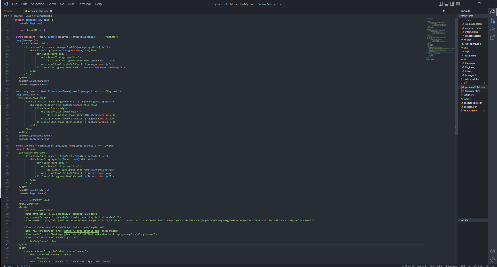
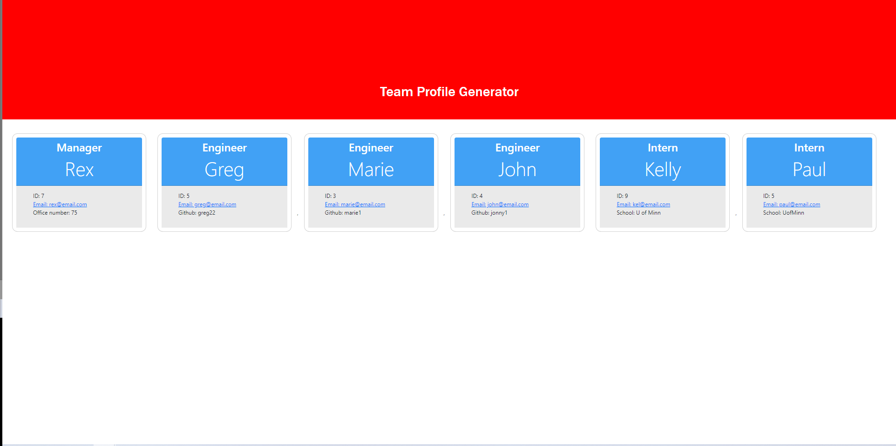

# OnMyTeam

  

  [GitHub Repo](https://github.com/ampatte/OnMyTeam)

  [Walkthrough Video](https://watch.screencastify.com/v/SWSUfCTzKQB19dqHJ2Eq)
  ## Description
  This project is a Node.js command-line application that takes in information about employees on a team and generates an HTML webpage that displays summaries for each team member.

  ## Acceptance Criteria
* GIVEN a command-line application that accepts user input
* WHEN I am prompted for my team members and their information
* THEN an HTML file is generated that displays a nicely formatted team roster based on user input
* WHEN I click on an email address in the HTML
* THEN my default email program opens and populates the TO field of the email with the address
* WHEN I click on the GitHub username
* THEN that GitHub profile opens in a new tab
* WHEN I start the application
* THEN I am prompted to enter the team manager’s name, employee ID, email address, and office number
* WHEN I enter the team manager’s name, employee ID, email address, and office number
* THEN I am presented with a menu with the option to add an engineer or an intern or to finish building my team
* WHEN I select the engineer option
* THEN I am prompted to enter the engineer’s name, ID, email, and GitHub username, and I am taken back to the menu
* WHEN I select the intern option
* THEN I am prompted to enter the intern’s name, ID, email, and school, and I am taken back to the menu
* WHEN I decide to finish building my team
* THEN I exit the application, and the HTML is generated

  ## Table of Contents
  - [Installation Instructions](#Installation)
  - [Usage Information](#Usage)
  - [Contribution Guidelines](#Contribution)
  - [Test Instructions](#Test)
  - [Questions](#Questions)
  - [License](#License)
  
  ## Installation
  To run this program you would open a terminal, and install Nodejs. You would also have to require inquirer, the file system and path for this program to run.

  ## Usage
  This project was an assignment but it is useful in keeping track of team members. I could be used to hold contact info or keep a list of responsibilities and tasks all in one place.
  
  
  
  ## Contribution
  I am the only contributor of this program.

  ## Test
  After navigating to the correct folder, entering "npm run test" will run the unit tests to check the code. Entering "npm start" will run the whole program. 

  ## Questions?
  - [Github link]( https://github.com/ampatte)
  - [Email link](ampatte717@gmail.com)

  ## License
    This project is covered under the MIT license.(https://choosealicense.com/licenses/mit/)
